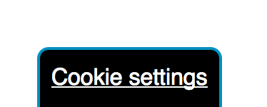

# Alternative Opt-in
An alternative opt-in cookie consent derived from cookieconsent.insites.com (see [https://github.com/insites/cookieconsent/](https://github.com/insites/cookieconsent/))

So using the JavaScript API ([JavaScript API](http://cookieconsent.insites.com/documentation/javascript-api/)) I have created an alternative Opt-in. Please note this is a rough example and could (a) be enchanced and cleaned up and (b) probably added back into the original library as an alternative Opt-in method.

The Opt-in that comes with [Cookie Consent](http://cookieconsent.insites.com/) is good and works. This is what it looks like:

However looking to use it with the GDPR changes and I believe it will not fit. The changes note that there needs to be a clear way to change your mind about cookies so you can easily enable or disable them. The current way to change your mind, shown below, automatically revokes your choice when you click it. What if you were just looking to see what you selected, too bad all your settings have just been revoked!

I have created an example that I believe fits the requirements. So what are the changes I have made in my example? Firstly I have replaced the dismiss button with a deny button. In other word it is no longer allow or ignore/dismiss but allow or deny so visitor has to make a choice and we do not assume anything. I have changed the default wording slightly as I believe essential cookies are still allowed (I might be wrong!). The buttons, allow and deny now highlight which option you have selected (see below).

 

Once an option is selected there is a pop up, the revoke button, that lets you change your choice (see below). I have overridden the code for this so that cookies are **NOT** deleted when you click it but that it simply display the selection bar showing your current choice. If decline is selected all current cookies are deleted unless you have deemed them essential (array in the code for that).

I am not a GDPR expert, this is my understanding. It is down to you to check it covers the requirements.
